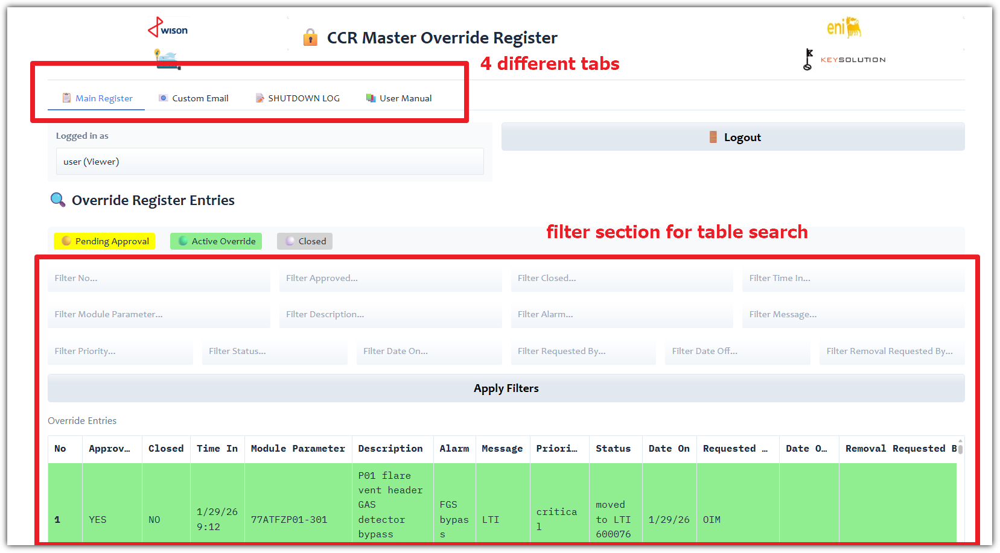
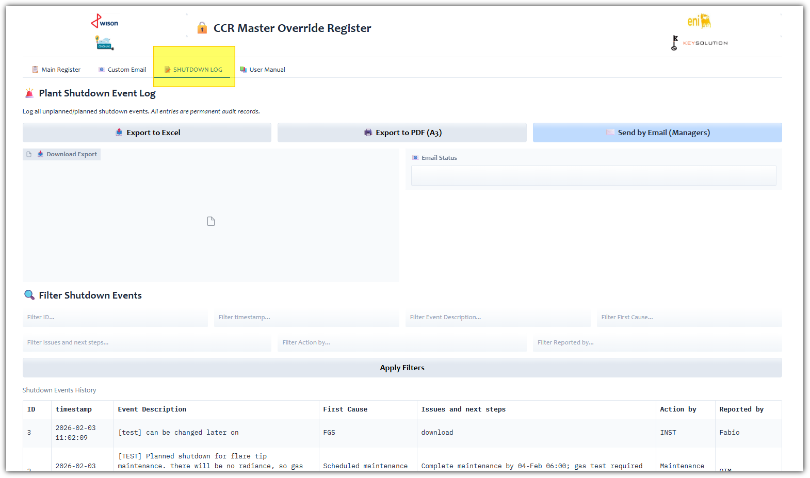
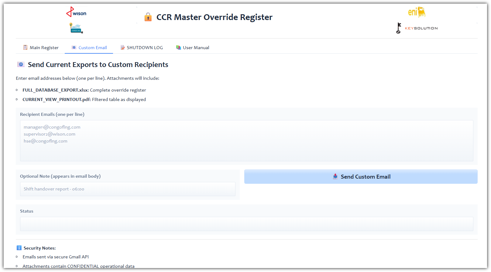

# 📘 CCR Master Override Register  
### *Operational Safety Management System for Central Control Room*

[](https://www.python.org/downloads/)
[](https://www.gradio.app/)
[](https://opensource.org/licenses/Apache-2.0)
[](https://www.shell.com/energy-and-innovation/natural-gas/lng.html)

> **🛡️ SAFETY-CRITICAL APPLICATION**  
> *Digital log for Fire & Gas System overrides and plant shutdown events. Compliant with FLNG Safety Procedures SP-FGS-003 and SP-SHUT-001.*

---

## 🌟 Why This Application Exists
In high-risk LNG operations, **every override and shutdown must be meticulously documented**. Paper logs get lost. Spreadsheets lack audit trails. This application solves critical operational gaps:
- ✅ **Real-time visibility** of active safety system bypasses across shifts
- ✅ **Automated regulatory compliance** with timestamped audit trails
- ✅ **Shift handover confidence** with color-coded status indicators
- ✅ **Zero data loss** with permanent shutdown event records (no deletion allowed)
- ✅ **Congo timezone-aware** scheduled reporting for operational rhythm


---

## 🚀 Key Features

### 🔒 Role-Based Safety Workflow
| Role | Permissions | Safety Critical Actions |
|------|-------------|-------------------------|
| **Operator** (`user`) | Create overrides/shutdowns | Logs initial event with timestamp |
| **Supervisor** (`manager`) | Approve overrides, edit shutdowns | **Authorizes safety bypasses** (🟡→🟢) |
| **Admin** (`admin`) | Import data, system maintenance | Manages audit integrity |

### 📊 Dual-Module Architecture
| Module | Purpose | Compliance Standard |
|--------|---------|---------------------|
| **FGS/ESD Override Register** | Track all ESD and Fire & Gas System bypasses | SP-FGS-003 |
| **Shutdown Log** | Permanent record of plant shutdown events | SP-SHUT-001 |

### 📤 Automated Reporting (Congo Timezone)
- **05:00 Daily**: Pre-day-shift report to managers
- **17:00 Daily**: Pre-night-shift report to managers  
📧 *4 attachments per email: Overrides (Excel+PDF) + Shutdowns (Excel+PDF)*

### 🌐 Operational Deployment
- **LAN Access**: Facility-wide access via `http://[SERVER_IP]:7860`
- **A3 Landscape PDFs**: Professional prints for CCR wall boards
- **Multi-line Text Support**: No truncated technical descriptions
- **Visual Status Indicators**:
  - 🟡 **Yellow**: Pending approval (requires supervisor action)
  - 🟢 **Green**: Approved active override (monitoring required)
  - ⚪ **Gray**: Closed/completed (audit archive)

---

## 🖼️ Application Screenshots
*(Add actual screenshots after deployment)*
| Main Override Register | Shutdown Log | Automated Email Report |
|------------------------|--------------|------------------------|
|  |  |  |

---

## 📦 Installation Guide

### Prerequisites
```bash
# Python 3.8+ required
python --version

# Install dependencies
pip install -r requirements.txt
```

### Configuration Checklist
1. **Create `emails.txt`** (manager distribution list):
   ```txt
   shift.supervisor@congoflng.com
   instrument.engineer@wison.com
   hse.advisor@congoflng.com
   # Add additional managers below
   ```

2. **Set Environment Variables** (critical for email):
   ```powershell
   # Windows PowerShell
   $env:GMAIL_APP_PASSWORD="your_16_digit_app_password"
   $env:FGS_EMAIL_SENDER="alerts@congoflng.com"
   ```
   > 🔑 **Gmail Setup**: Enable 2FA → [Generate App Password](https://myaccount.google.com/apppasswords) → Use 16-digit code

3. **Prepare Initial Data** (optional):
   - Place `20260129_CCR_BPO_register_FGS_consolidated.xlsx` in root directory
   - System auto-creates database on first launch

### Launch Application
```bash
python app.py
```
✅ **Success indicators**:
```
✅ Email scheduler thread started: EmailScheduler
✅ PDF generation available (fpdf2 installed)
🚀 CCR MASTER OVERRIDE REGISTER - NETWORK ACCESS INFO
📍 LOCAL ACCESS: http://127.0.0.1:7860
🌐 LAN ACCESS: http://192.168.1.35:7860
```


---

## 🔐 Default Credentials (CHANGE IN PRODUCTION!)
| Role | Username | Password | First Login Action |
|------|----------|----------|---------------------|
| Operator | `user` | `user` | Log test override event |
| Supervisor | `manager` | `manager` | Approve pending override |
| Admin | `admin` | `admin` | Verify email scheduler |

> ⚠️ **SECURITY CRITICAL**:  
> 1. Change passwords in `app.py` (lines 180-184) before deployment  
> 2. Configure Windows Firewall: Allow TCP port 7860  
> 3. Deploy on isolated operational network (NOT public internet)  
> 4. Use HTTPS reverse proxy (Nginx) for encryption in production

---

## 📁 Project Structure
```
fgs-override-register/
├── app.py                      # Main application (Gradio interface)
├── manual.md                   # In-app user manual (auto-loaded)
├── requirements.txt            # Python dependencies
├── shutdown.json               # Shutdown log data (auto-created)
├── fgs_overrides.db            # SQLite override database (auto-created)
├── emails.txt                  # Manager email distribution list (CREATE MANUALLY)
├── 20260129_CCR_BPO_register_FGS_consolidated.xlsx  # Initial template (optional)
├── images/                       # Documentation and screenshots
│   ├── overrides.png
│   ├── SHUTDOWNlogs.png
│   ├── login.png
│   ├── overrides_001.png
│   ├── overrides_002.png
│   ├── Susermanual.png
│   └── den_overridelist_email.png
├── logo.png                    # Application logo
├── wisonLOGO.png               # Wison Engineering logo
├── congoFLNG.png               # Congo FLNG facility logo
└── ENIcongo.jpg                # ENI Congo logo
```

---

## 🌍 Congo FLNG Operational Context
This application was developed specifically for:
- **Location**: Congo Republic FLNG facility (Pointe-Noire)
- **Timezone**: Africa/Brazzaville (UTC+1, no DST)
- **Regulatory Framework**:
  - SP-FGS-003: Fire & Gas System Override Management
  - SP-SHUT-001: Plant Shutdown Event Documentation
- **Critical Safety Philosophy**:  
  *"No override without documentation. No shutdown without traceability."*

---

## 🤝 Contributing
Contributions must maintain **safety-critical integrity**:
1. All changes require Congo FLNG HSE approval
2. Test thoroughly in staging environment before deployment
3. Maintain audit trail integrity (no data deletion capabilities)
4. Preserve Congo timezone scheduling logic

---

## 📜 License
```
Confidential Property of Congo FLNG and Key Solution SRL
Unauthorized use, distribution, or modification prohibited.

Developed for NGUYA FLNG Project under contract with Wison Engineering
© 2026 Key Solution SRL | fabio.matricardi@key-solution.eu
```

---

## 🙏 Acknowledgements
| Organization | Contribution |
|--------------|--------------|
| **Congo FLNG Operations Team** | Requirements definition, safety validation, field testing |
| **Wison Engineering** | Project sponsorship, domain expertise, regulatory alignment |
| **Key Solution SRL** | Full-stack development, Congo timezone implementation |
| **Gradio Team** | Framework enabling rapid safety-critical UI development |

---

> **⚠️ SAFETY NOTICE**  
> This software is part of a safety management system.  
> Always follow site-specific procedures and regulatory requirements.  
> Software output does not replace qualified human judgment.  
> *Last Updated: February 4, 2026 | Document ID: CCR-APP-README-1.0*


